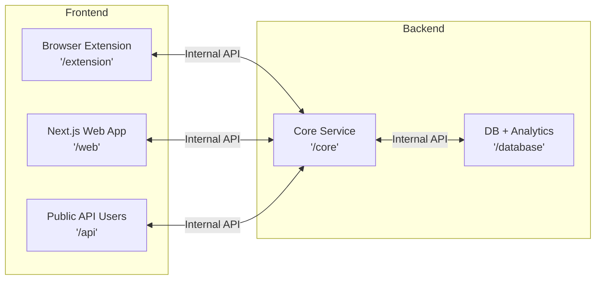

# Promptonomics

## Architecture

A platform with three surfaces, one brain and one storage.

```mermaid
flowchart LR
    subgraph Frontend
        BE[Browser Extension<br/>'/extension']
        WEB[Next.js Web App<br/>'/web']
        API[Public API Users<br/>'/api']
    end

    subgraph Backend
        CORE[Core Service<br/>'/core']
        DB[DB + Analytics<br/>'/database']
    end

    %% Internal APIs
    BE <-->|Internal API| CORE
    WEB <-->|Internal API| CORE
    API <-->|Internal API| CORE
    CORE <-->|Internal API| DB

    


    %% Repo folder links
    click BE "https://github.com/saad2134/Promptonomics/tree/main/extension" "Open /extension folder"
    click WEB "https://github.com/saad2134/Promptonomics/tree/main/web" "Open /web folder"
    click API "https://github.com/saad2134/Promptonomics/tree/main/api" "Open /api folder"
    click CORE "https://github.com/saad2134/Promptonomics/tree/main/core" "Open /core folder"
    click DB "https://github.com/saad2134/Promptonomics/tree/main/database" "Open /database folder"

```

